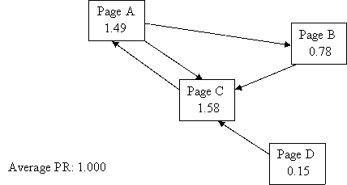

# Fast Personalized PageRank Implementation

I needed a fast PageRank for [Wikisim](https://github.com/asajadi/wikisim) project. It had to be fast enough to run real time on relatively large graphs. NetworkX was the obvious library to use, however, it needed back and forth translation from my graph representation (which was the pretty standard csr matrix), to its internal graph data structure. These translations were slowing down the process. 

I implemented two versions of the algorithm in Python, both inspired by the sparse fast solutions given in [**Cleve Moler**](https://en.wikipedia.org/wiki/Cleve_Moler)'s book, [*Experiments with MATLAB*](https://www.mathworks.com/content/dam/mathworks/mathworks-dot-com/moler/exm/chapters/pagerank.pdf). The power method is much faster with enough precision for our task. 

### Personalized PageRank
I modified the algorithm a little bit to be able to calculate **personalized PageRank** as well. 


### Comparison with Popular Python Implementations: NetworkX and iGraph
Both implementations (exact solution and *power method*) are much faster than their correspondent methods in NetworkX. The *power method* is also faster than the iGraph native implementation, which is also an eigen-vector based solution. Benchmarking is done on a `ml.t3.2xlarge` SageMaker instance. 

### What is the major drawback of NetworkX PageRank?
I gave up using NetworkX for one simple reason: I had to calculate PageRank several times, and my internal representation of a graph was a simple sparse matrix. Every time I wanted to calculate PageRank I had to translate it to the graph representation of NetworkX, which was slow. My benchmarking shows that NetworkX  has a pretty fast implementation of PageRank ( `networkx.pagerank_numpy` and  '`networkx.pagerank_scipy`), but translating from its own graph data structure to a csr matrix before doing the actual calculations is exactly what exactly slows down the whole algorithm. 

**Note**: I didn't count the time spent on `nx.from_scipy_sparse_matrix` (converting a csr matrix before passing it to NetworkX PageRank) in my benchmarking, But I could! Because that was another bottleneck for me, and for many other cases that one has a `csr` adjacency matrix.

### Python Implementation
The python package is hosted at https://github.com/asajadi/fast-pagerank and you can find the installation guide in the [README.md](https://github.com/asajadi/fast-pagerank/blob/master/README.md) file. You also can find this jupyter notebook in [the notebook directory](https://github.com/asajadi/fast-pagerank/blob/master/notebooks/Fast-PageRank.ipynb). 


## Usage
### Installation:
`pip install fast-pagerank`

### Example
Let's take Example 1 from https://www.cs.princeton.edu/~chazelle/courses/BIB/pagerank.htm 



Assuming A=0, B=1, C=2, D=3:

```
>>> import numpy as np
>>> from scipy import sparse
>>> from fast_pagerank import pagerank
>>> from fast_pagerank import pagerank_power
>>> A = np.array([[0,1], [0, 2], [1, 2],[2,0],[3,2]])
>>> weights = [1,1,1,1,1]
>>> G = sparse.csr_matrix((weights, (A[:,0], A[:,1])), shape=(4, 4))
>>> pr=pagerank(G, p=0.85)
>>> pr
array([0.37252685, 0.19582391, 0.39414924, 0.0375    ])
```

The output elements are essentially the same numbers written on the nodes, but normalized (multiply the vector by $4$ and you will get the same numbers) 

We can add personalization, or use *power method*:

```
>>> personalize = np.array([0.4, 0.2, 0.2, 0.4])
>>> pr=pagerank_power(G, p=0.85, personalize=personalize, tol=1e-6)
>>> pr
array([0.37817981, 0.18572635, 0.38609383, 0.05      ])
```